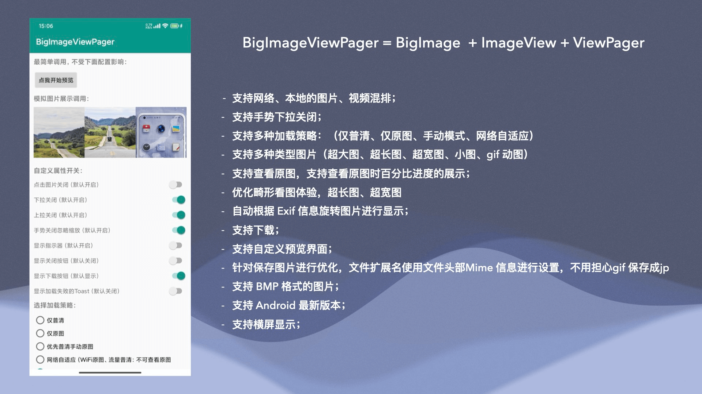
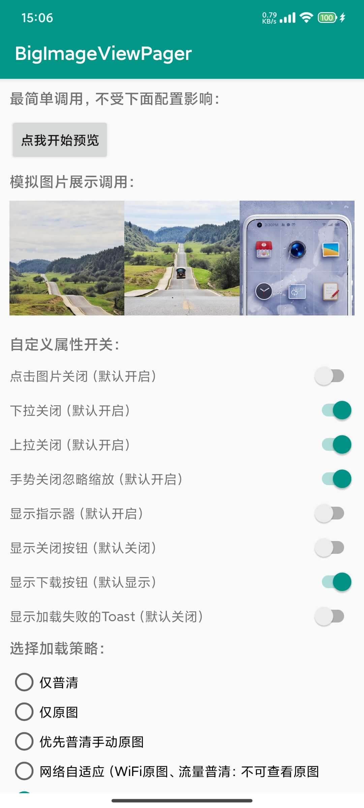
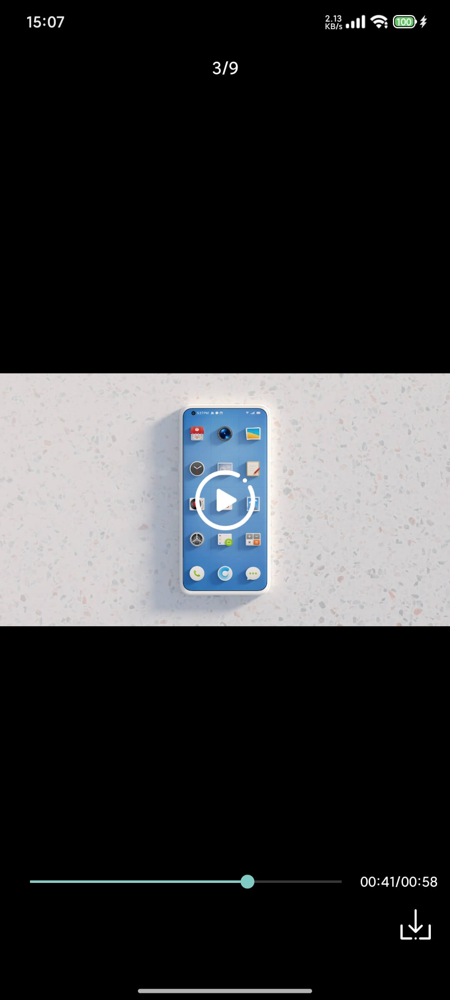
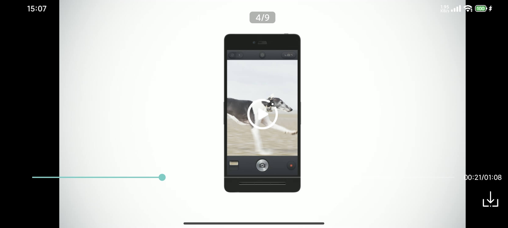

<p align="center">
  
</p>

<h1 align="center">BigImageViewPager</h1>

<p align="center">
  📷 一个支持 <b>超大图 / 超长图 / 动图 / 视频</b> 的轻量级浏览器库  
</p>

<p align="center">
  <a href="https://maven.org/"></a>
  <a href="https://github.com/SherlockGougou/BigImageViewPager/stargazers"></a>
  <a href="https://github.com/SherlockGougou/BigImageViewPager/blob/master/LICENSE"></a>
</p>

---

## ✨ 特性

- 支持 **超大图 / 超长图 / GIF / 视频**
- 支持 **手势缩放 / 滑动切换**
- 支持 **原图查看 / 下载 / 加载进度**
- 支持 **动态更新 / 删除数据源**
- **区块复用加载** → 优化内存占用，有效避免 OOM

---

## 📦 安装体验

<p align="center">
  
</p>

---

## 🆕 更新日志

- **androidx-8.4.6**：新增支持res资源
- **androidx-8.4.5**：新增自定义请求头功能  
- **androidx-8.4.4**：修复本地视频加载存在的问题  

---

## 🎨 界面展示

<p align="center">
  
  
  
</p>

<p align="center">
  
</p>

<p align="center">
  
  
</p>

---

## 🎬 视频展示

https://github.com/user-attachments/assets/101d706c-d8d0-455b-b38a-6c42282c03e2

https://github.com/user-attachments/assets/b7becb07-e6bd-459b-9795-d048d02fb21b

https://github.com/user-attachments/assets/070caa63-8e9f-4b11-9240-4cb56440d3c2

---

## ⭐️ Star 曲线

[](https://star-history.com/#SherlockGougou/BigImageViewPager&Date)

---

## 🚀 快速开始

### 1️⃣ 添加依赖

在 `project/build.gradle` 中加入：

```gradle
allprojects {
    repositories {
        mavenCentral()
    }
}
```

在 `app/build.gradle` 中添加：最新版本 <a href="https://maven.org/"></a>
```
dependencies {
    // 框架 
    implementation 'com.gouqinglin:BigImageViewPager:版本号'

    // Glide
    def glideVersion = "4.16.0"
    implementation "com.github.bumptech.glide:glide:$glideVersion"
    annotationProcessor "com.github.bumptech.glide:compiler:$glideVersion"
    implementation "com.github.bumptech.glide:okhttp3-integration:$glideVersion"

    // ExoPlayer (Media3)
    def media3Version = "1.4.1"
    implementation "androidx.media3:media3-exoplayer:$media3Version"
    implementation "androidx.media3:media3-exoplayer-dash:$media3Version"
    implementation "androidx.media3:media3-ui:$media3Version"
}
```

### 2️⃣ 配置 GlideModule
```
@GlideModule
public class MyAppGlideModule extends AppGlideModule {
  @Override
  public void registerComponents(@NonNull Context context, @NonNull Glide glide, @NonNull Registry registry) {
    super.registerComponents(context, glide, registry);
    registry.replace(
      GlideUrl.class,
      InputStream.class,
      new OkHttpUrlLoader.Factory(ProgressManager.getOkHttpClient())
    );
  }
}
```
⚠️ 必须配置，否则原图加载进度可能卡在 1%！

### 3️⃣ 调用示例
```
ImagePreview
    .getInstance()
    .setContext(MainActivity.this)
    .setMediaInfoList(imageInfoList)
    .start();
```
### 详细配置文档：<a href="https://github.com/SherlockGougou/BigImageViewPager/blob/master/doc/DETAIL.md">详细文档</a>。

### 🙏 致谢
- <a href="https://github.com/davemorrissey/subsampling-scale-image-view">subsampling-scale-image-view</a> —— 提供大图加载核心
- <a href="https://github.com/sunfusheng/GlideImageView">GlideImageView</a> —— 进度监听实现参考

### 💬 社区交流
<p align="center">
  
</p>

### ☕ 支持我
<p align="center">
  
  
</p>

### 📄 License
```
Copyright (C) 2018 SherlockGougou
Licensed under the Apache License, Version 2.0
http://www.apache.org/licenses/LICENSE-2.0
```

<p align="center">
  <a href="https://dartnode.com" title="Powered by DartNode - Free VPS for Open Source">
    
  </a>
</p>
